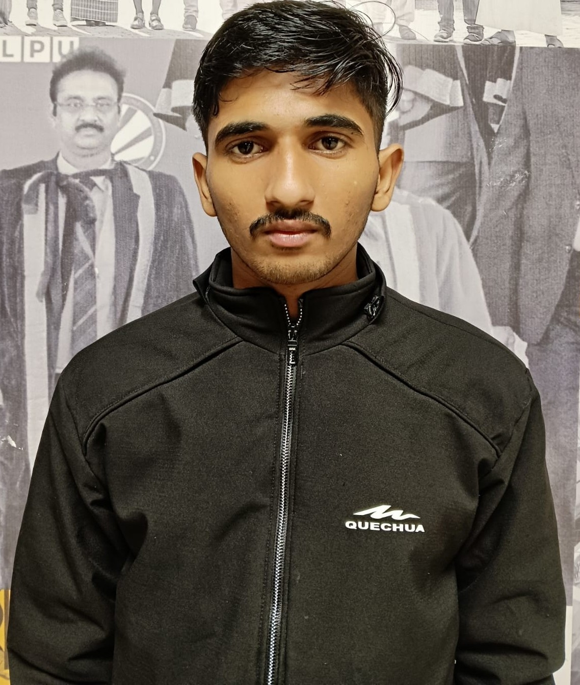

<table>
<tr>
<td width="180" align="center">
  
</td>
<td>
  <h1>Ankush Pahal</h1>
  <h3>Data Engineer • Full-Stack AI Developer</h3>
  
🎓 B.Tech – Computer Science Engineering (AI & ML), Lovely Professional University, Punjab — CGPA 6.65

</td>
</tr>
</table>

  

  
  
  <!-- Resume badge: replace the # with a link to your resume PDF or portfolio site -->
  

<!-- Currently working on: keep this to one line, update whenever your focus shifts -->

🔭 Currently deep in system design for a real-time multiplayer chess app — auth, reconnection handling, and a six-state game engine

---

### Tech Stack

**Languages**

**AI / ML**

  
  
  
  
  

**Backend & Real-time**

**Data & Databases**

**Cloud & DevOps**

**Tools**

  
  

<!-- Skill proficiency bars: a lightweight, purely visual way to signal strongest areas at a glance -->
**Core Strengths**

  Python &nbsp; 
  System Design &nbsp; 
  LLM/Agent Systems &nbsp; 
  Data Engineering &nbsp;

---

<!-- How I work: short, scannable, gives recruiters a sense of process not just tech list -->
### How I Work
- **Spec before code** — I work through auth flows, state machines, and edge cases on paper before writing implementation.
- **Iterate in the open** — bugs get logged and fixed in public commits, not squashed into a single "final" push.
- **Measure, don't assume** — projects like RAMP ship with real benchmarks (pass rate, compression ratio, correlation), not just a working demo.

---

### Featured Projects

**AI Investment Research Agent**
`Next.js 14` `LangGraph.js` `Groq/Llama` `MongoDB Atlas` `SSE`
Five sequential AI agents generating INVEST/PASS verdicts for US & Indian markets, with real-time streaming and 10-K RAG analysis via Gemini embeddings.

**Real-Time Multiplayer Chess**
`React` `Node.js` `Socket.IO` `MongoDB`
In-design: auth, game-state recovery, reconnection handling, six-state game engine.

**RAMP — Risk-Aware Memory-Assisted Prompt Compression**
`Research` `LLM Systems`
Formal compression framework (MRS/SPS/RS metrics) — 75% pass rate, 1.25x compression, r=0.81 correlation.

<!-- Collapsible section: keeps older/less-current work available without crowding the top of the page -->

<b>Older Projects</b> (click to expand)

 

**Autonomous Talent Partner**
`FastAPI` `Neo4j` `ChromaDB` `Multi-Agent RAG`
AI hiring platform with semantic candidate-job matching and bias-aware ranking.

---

### Pinned Repos

  
  

  
  

---

### GitHub Stats

  
  

  

<!-- Trophy row: compact badges for streaks, stars, PRs, issues -->

  

<!-- WakaTime: requires the WakaTime browser/IDE extension + a pinned "Weekly development breakdown" gist. See setup note below. -->
### Weekly Coding Activity

  

↳ needs a WakaTime account linked to your GitHub username — setup note below

### Activity Graph

  

### Contribution Snake

  

↳ snake needs a one-time GitHub Action to generate — setup covered separately

---

### DSA

---

<!-- Blog/Writing: replace with your actual dev.to/Medium/Hashnode link once you publish something -->
### Writing

  

---

Open to Data Engineering & AI Engineer roles

